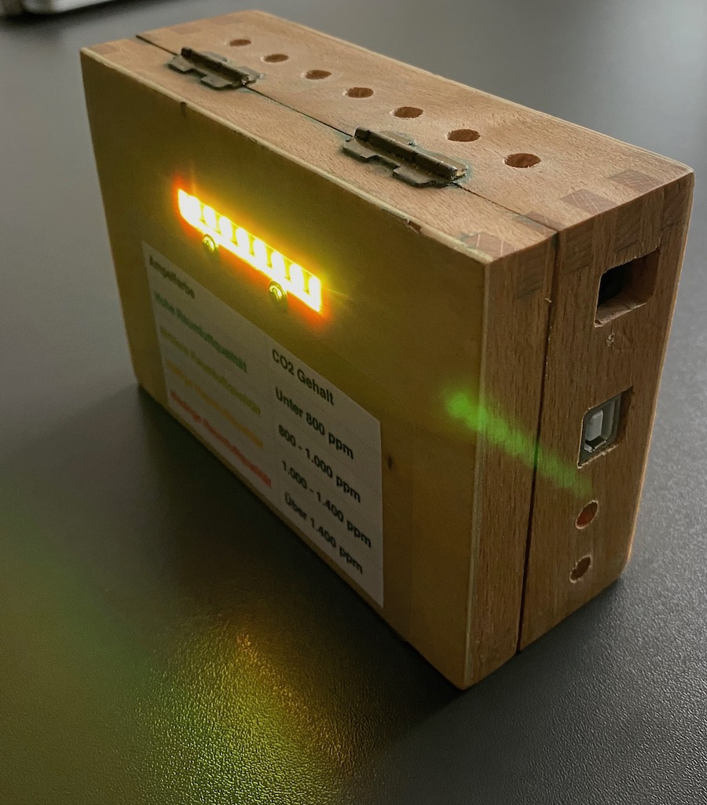
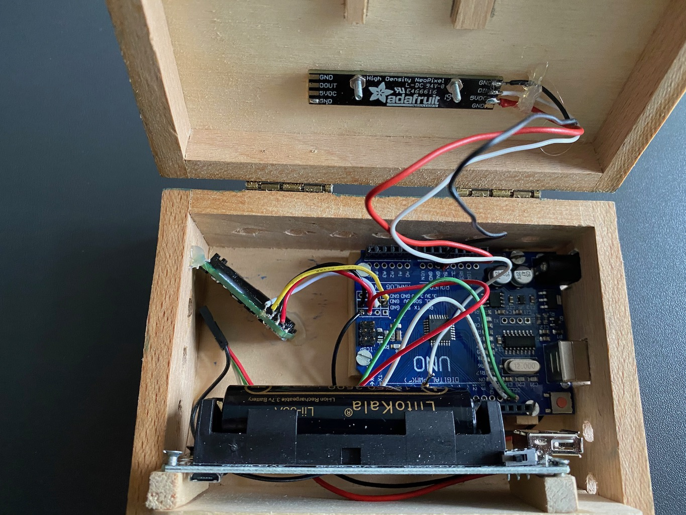
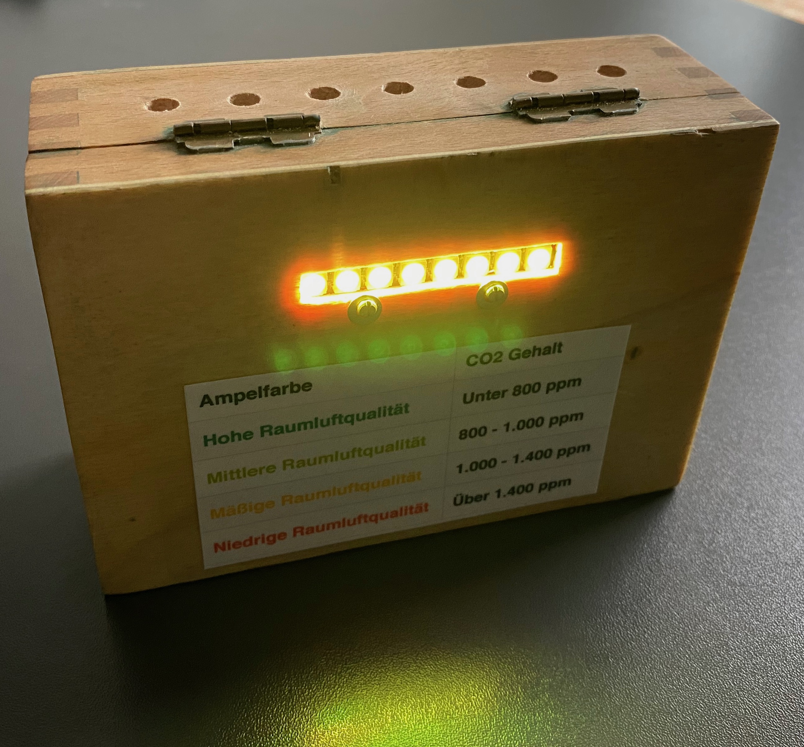

# CO2 Ampel

Für die Schullklasse meines Sohnes habe ich eine CO2 Ampel gebaut  damit die Kids und die Lehrer eine Idee davon bekommen, wieoft sie in diesen Coronazeiten lüften müssen - 
und ob sie tatsächlich gut genug gelüftet haben. Die Inspiration dazu 

Eigentlich wollte ich eine LoRaWAN basierte Lösung bauen. 
Dazu wollte ich den ESP32 basierten TTGO T-Beam "Knochen" benutzen.
Aber weil der TTGO offensichtlich Timingprobleme mit dem "Rx Fenstern" hat, und sowieso nicht klar ist ob aus der Schule raus das nächste LoRa Gateway erreicht werden kann, 
kam als schnelle Lösung nur etwas ohne Funk in Betracht. Denn in unserer Schule gibt es auch nur sehr lückenhaftes WLAN. 

Deshalb habe ich einen alten Arduino Uno mit einem Sensirion SCD30 und einem 8 Neopixel Streifen kombiniert. Ursprünglich war noch ein kleines 128x32 OLED Display zum Anzeigen des aktuellen CO2 Werts dabei, ist mir aber beim hantieren kaputt gegangen. Und neue Displays aus China dauern... 
So bleibt es halt bei der Ampel.

## Hardware 

für die Holzkistenversion:

| Bauteil | Zweck | Preis |
|------|----|----|
| [Arduino Uno](https://de.aliexpress.com/item/32932088536.html?spm=a2g0o.productlist.0.0.74a383c8rIANiR) | im Prinzip kann jeder andere kleine Controller genommen werden, er sollte wegen der Neopixel aber 5V Spannung unerstützen. | 4 EUR |
| [18650 Battery holder/charger](https://de.aliexpress.com/item/4000411334298.html?spm=a2g0s.9042311.0.0.7d914c4dkW0b2I) | Lädt 18650 Akkus und liefert sowohl 3.3 als auch 5V | 4,20 EUR| 
| [18650 Battery](https://de.aliexpress.com/item/4000473717342.html?spm=a2g0o.detail.1000060.1.60a04abfdqh1094) | Akku, da hat sich was bei den Shipping Kosten geändert ! | 3 EUR  | 
| [Sensirion SCD30 CO2 Sensor](https://www.digikey.de/products/de/sensors-transducers/gas-sensors/530?k=sensirion%20scd30) | der CO2 Sensor | 46 EUR | 
| [Adafruit Neopixel 8-LED strip](https://www.digikey.de/product-detail/de/adafruit-industries-llc/2867/1528-1593-ND/5875801) | es müssen nicht gleich 8 Neopixel sein | 6,80 EUR | 
| ein 470 Ohm Widerstand | für die Neopixel Datenleitung, Anleitung hierzu [Neopixel Guide](https://learn.adafruit.com/adafruit-neopixel-uberguide/basic-connections) | 2 cent ? | 
| Holzkiste aus Rest-Bestand
| [128x32 OLED display](https://de.aliexpress.com/item/32672327708.html?spm=a2g0s.9042311.0.0.6b364c4d8kBq0N) | das kleine Display war ursprünglich vorgesehen um den tatsächlichen CO2 Wert anzuzeigen. | 2,50 EUR| 
| **Gesamt** | ohne Gehäuse | **~ 67 EUR** |
  
### Verdrahtung

- Sensirion & Display werden beide parallel an den I2C bus angeschlossen. 
  Mein Arduino hat zufällig 2 parallele I2C Anschlüsse! (Also SCL and SCL, SDA an SDA, GND and GND und 5V an 5V)
- Das Neopixel an 5V, Gnd und einen freien IO Pin des Arduino, hier Pin 6 (siehe code).
- Vom Battery holder habe ich die 5V an den Platinen Kontakten des großen USB Steckers abgegriffen,  weil dann der im Halter eingebaute Schalter die ganze Kiste an/ausschalten kann.  

## Software

Als Softwareentwicklungsumgebung für den Arduino benutze ich [platformio](https://platformio.org/). Damit sollten für das compilieren und flashen der SW alle nötigen Einstellungen und Bibliotheken zum Projekt mitgeliefert sein. 

Der Code an sich ist sehr simpel gehalten und kombiniert fast nur den Beispielcode verwendeten Bibliotheken.
Die Anfangsspielerei, die Regenbogenfarben auf den LEDs zu zeigen dient dazu, die Zeit bis zum vorliegen der ersten Messwerte visuell zu überbücken.
